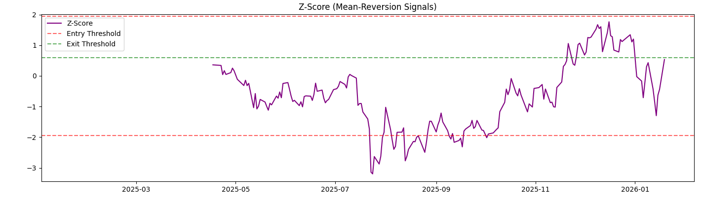
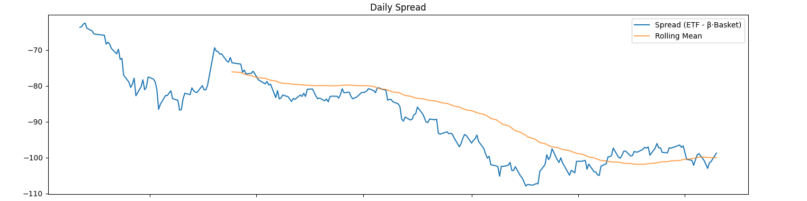
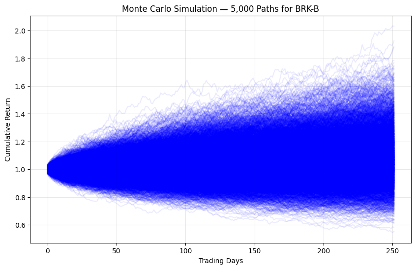

# AI-Investor-Distillation-Trading-Agent

**AI-Powered Extension of "Daily Stat-Arb Pipeline: 2800.HK vs Hang Seng Index Basket"**

This project extends my previous **Statistical Arbitrage framework** on the TraHK ETF (2800.HK) by integrating **AI skill distillation**, intelligent research agents, and advanced quantitative risk modeling.

## 🎯 Project Overview

**Original Project**: Daily Statistical Arbitrage Pipeline on 2800.HK ETF  
**This Extension**: Added AI layer + Monte Carlo risk engine to create a more powerful, hybrid quant trading system.
Built specifically to demonstrate capabilities relevant to **AI Research & Trading Automation** and **Data Analyst (Asset Management)** roles.

## ✨ Key Enhancements (New in this Version)

- **AI Skill Distillation**: LLM-powered extraction of investment philosophies from Warren Buffett, Ray Dalio, and other legendary investors into structured rules, criteria, and reusable LLM prompts.
- **AI Stock Research Agent**: Autonomous agent that combines fundamental metrics with natural language analysis from news and reports.
- **Monte Carlo Risk Simulation**: 5,000+ scenario paths with Expected Return, 95% VaR, and CVaR analysis for robust forecasting and risk management.
- **TradingView Integration**: Custom Pine Script v5 indicator for mean-reversion + volatility screening.
- **Enhanced Backtesting**: Improved the original statistical arbitrage pipeline with AI-driven insights and regime-aware risk controls.

## 🛠 Tech Stack

- **Core**: Python, pandas, yfinance, numpy, matplotlib
- **AI/LLM**: OpenRouter (Llama 3.1 70B)
- **Risk Modeling**: Monte Carlo Simulation
- **Trading**: Pine Script v5
- **Base Framework**: Extended from original 2800.HK Stat-Arb Pipeline

## Motivation
Demonstrate classic statistical arbitrage pipeline under real-world Hong Kong market data constraints (poor intraday reliability via Yahoo Finance in 2025–2026).  
Focus: hedge ratio stability, cost-aware backtesting, signal realism on efficient ETF.

## What it does
- Dynamic market-cap weighted synthetic index from ~90 HSI constituents
- Blended hedge ratio (log-prices + price-ratio normalization)
- Z-score based mean-reversion signals
- Parameter sweep + explicit transaction cost modeling (8/12/16 bps round-trip)
- Realistic metrics: Sharpe, drawdown, turnover, hold period

## Key Results

| Param set       | Cost (bps) | Trades | Ann. Return | Sharpe | Max DD | Win % | Avg Hold (days) | Turnover (×/yr) |
|-----------------|------------|--------|-------------|--------|--------|-------|-----------------|-----------------|
| Aggressive      | 8          | 5      | 26%         | 0.79   | -14%   | 80%   | 11              | 2.6             |
| Very Conservative | 8        | 3      | 4%          | 0.11   | -15%   | 67%   | 14              | 1.5             |

**Takeaway**: Modest edge possible in simulation, but collapses under realistic HK costs/slippage → aligns with tight premium/discount of TraHK.

- Successfully distilled investment philosophies of **Warren Buffett** and **Ray Dalio** into structured, reusable formats.
- Generated professional AI-powered research notes for major stocks (e.g. 2800.HK / BRK-B).
- Monte Carlo Simulation on 2800.HK / BRK-B showed realistic 1-year risk-return profiles:
  - Expected Return: ~8.81% (BRK-B example)
  - 95% VaR: -19.65%
  - CVaR (Expected Shortfall): -25.27%
- Built a clean, reusable framework that bridges traditional quant strategies with modern AI tools.

## Visual Results

### Rolling Z-Score (Mean-Reversion Signals)
Normalized spread with entry/exit thresholds (typical entry |z| > 2.0–2.5, exit |z| < 0.5–0.8).

### Daily Spread (ETF – β-weighted Basket)
Raw spread before normalization, shown with 252-day rolling mean.

**Monte Carlo Simulation — 5,000 Possible 1-Year Price Paths for 2800.HK**

## Limitations & Lessons
- Very low trade frequency (sampling noise dominant)
- No volatility targeting / position sizing yet
- Efficient ETF → daily arb edge is minimal (better intraday or stress periods)
- Learned: cost modeling & hedge ratio debugging are critical

## 🚀 How to Run

1. Open `AI_Quant_Trading_Agent_ChinaRise.ipynb` in Google Colab
2. Add your `OPENROUTER_API_KEY` in Colab Secrets
3. Run cells sequentially

---

**Kyle Chan**  
Bachelor of Arts and Sciences in Social Data Science  
The University of Hong Kong  
(+852) 6761 0118 | wangtikchan715@gmail.com  
[LinkedIn](https://linkedin.com/in/wang-tik-chan)

---
